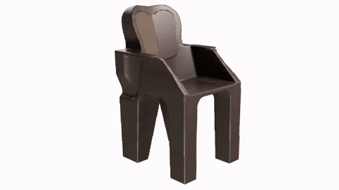

 

⏩ **TL;DR:** I am a mechanical engineering undergrad and I do data science and deep learning.
   
✉ muqadir1@gmail.com
   
👏 During my freshman year, I realized that in whatever the condition one is in, by challenging and focusing on the goal one can improve and improvise oneself. In the first semester, I got a below-average grade point average of 3.09. For me instead of GPA, not having good learning and proper planning were the things worth worrying about. So, I took progress, punctuality, and better planning as a challenge, and by the grace of Allah Almighty, I was able to get into Dean's List by replacing 9 in my GPA from 3.09 to 3.90 at the end of my freshman year.
   
✨ Hi, I am a zealous mechanical engineering student who loves to challenge mechanical industries to progress towards Industry 4.0.
   
💖 I love MOOCs, OCWs, and all the platforms that are playing their role in free learning.
   
🐛 I can refine, educate and drive myself to be better me.
   
- ✅ I am constantly learning and never settle.
- ✅ I speak design, product, tech, and the art of learning.
- ✅ The buck stops with me.

  
🤝 I love to meet people and hear their perspectives. Reach out to me if you want to discuss emerging tech, innovative engineering solutions and case studies.
   
👀 Domain Knowledge:  
Mechanical Engineering Design | Project Management | Data Science | Machine Learning | IoT | Digital Manufacturing and Design (DMD) | Generative Design
   
👨‍💻 Software/Skills:  
Solidworks | Fusion 360 | AutoCAD | Matlab | Latex | MS Office | Python
   
🔗 Read More at http://usamanavid.com/
